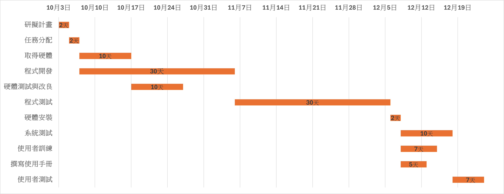
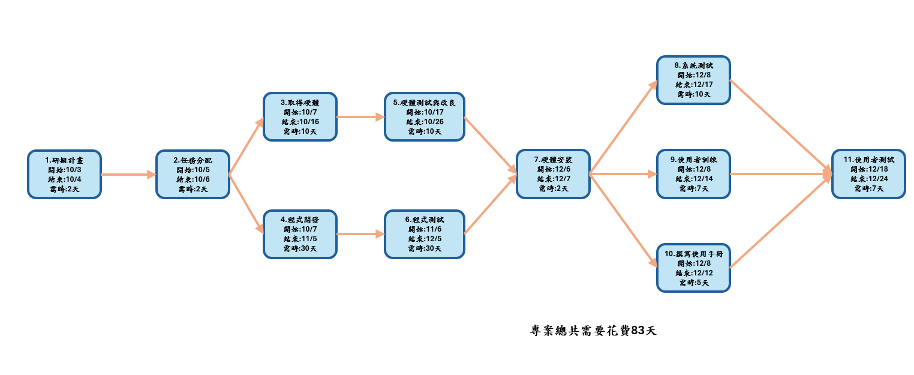

## 專題題目
視障者輔助AI系統 

## 內容

依據估計，全球視障人數將從2015年的3600萬增加到2050年的1.15億以上，這些視障者的生活需要社會與政府的更多關注。最基本的戶外行動時，視障者最常採用白手杖或導盲犬協助，但是白手杖無法提供重要的訊息，例如障礙物位置、類型、距離，這些資訊對於視障者的環境感知和移動安全是很重要的。導盲犬雖可協助視障人士避開障礙物，然而飼養和訓練導盲犬的成本非常高，而且在臺灣視障者需要排隊申請，等待至少數個月以上才有機會領養到導盲犬，所以大多數的視障朋友，是不會考慮的。因此許多研究人員嘗試為視障人士開發各種輔助設備，希望能引導視障者安全地行動。目前國際上已經開發了許多輔助裝置來實現這些目標，其中大部分依賴於智慧型手機、各種感測器或電腦視覺等。

### 小組成員:
C111118204 簡凱成(組長)  
C111118209 李郅陞  
C111118219 李雅婷  
C111118241 傅冠中  
C111118244 陳弘翊  
