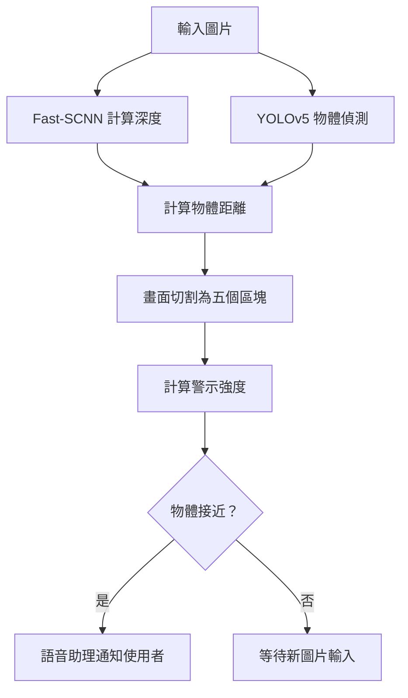

```mermaid
graph TD
    A[輸入圖片] --> B[Fast-SCNN 計算深度]
    A --> C[YOLOv5 物體偵測]
    B --> D[計算物體距離]
    C --> D
    D --> E[畫面切割為五個區塊]
    E --> F[計算警示強度]
    F --> G{物體接近？}
    G -- 是 --> H[語音助理通知使用者]
    G -- 否 --> I[等待新圖片輸入]

```
