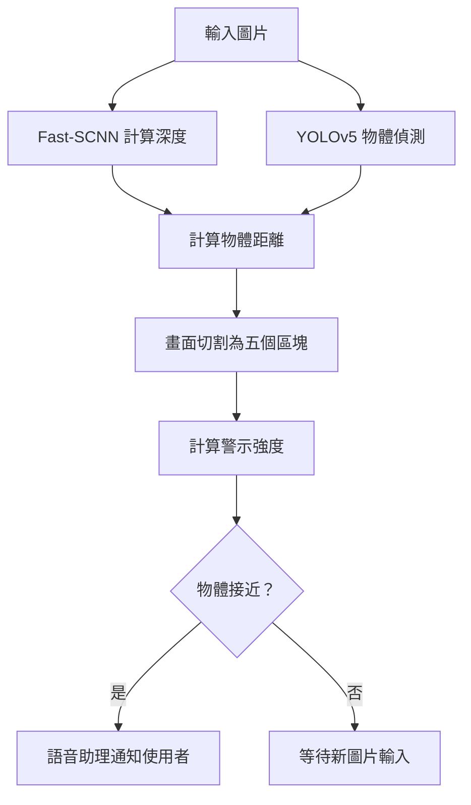
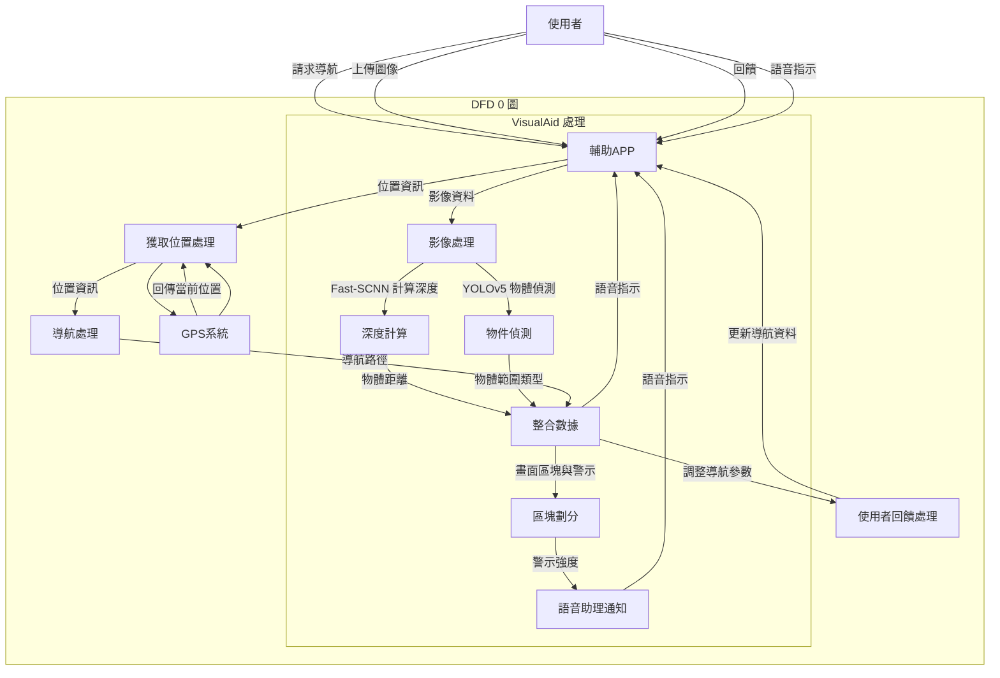

```mermaid
graph TD
    A[輸入圖片] --> B[Fast-SCNN 計算深度]
    A --> C[YOLOv5 物體偵測]
    B --> D[計算物體距離]
    C --> D
    D --> E[畫面切割為五個區塊]
    E --> F[計算警示強度]
    F --> G{物體接近？}
    G -- 是 --> H[語音助理通知使用者]
    G -- 否 --> I[等待新圖片輸入]

```

```mermaid
flowchart TD
    %% 定義外部實體和資料流
    使用者 -->|請求導航| 輔助APP
    使用者 -->|上傳圖像| 輔助APP
    使用者 -->|回饋| 輔助APP
    
    %% 定義處理程序和資料流
    subgraph DFD 0 圖
        輔助APP -->|位置資訊| 獲取位置處理
        獲取位置處理 --> GPS系統
        GPS系統 -->|回傳當前位置| 獲取位置處理
        獲取位置處理 -->|位置資訊| 導航處理
        
        %% 視覺輔助流程
        輔助APP -->|影像資料| 影像處理
        subgraph VisualAid 處理
            影像處理 -->|Fast-SCNN 計算深度| 深度計算
            影像處理 -->|YOLOv5 物體偵測| 物件偵測
            深度計算 -->|物體距離| 整合數據
            物件偵測 -->|物體範圍類型| 整合數據
            整合數據 -->|畫面區塊與警示| 區塊劃分
            區塊劃分 -->|警示強度| 語音助理通知
            語音助理通知 -->|語音指示| 輔助APP
        end
        
        導航處理 -->|導航路徑| 整合數據
        整合數據 -->|語音指示| 輔助APP
        
        整合數據 -->|調整導航參數| 使用者回饋處理
        使用者回饋處理 -->|更新導航資料| 輔助APP
    end
    
    %% 定義外部實體
    GPS系統 --> 獲取位置處理
    使用者 -->|語音指示| 輔助APP
```
