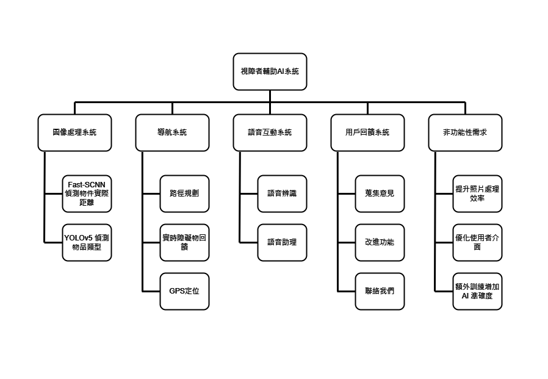
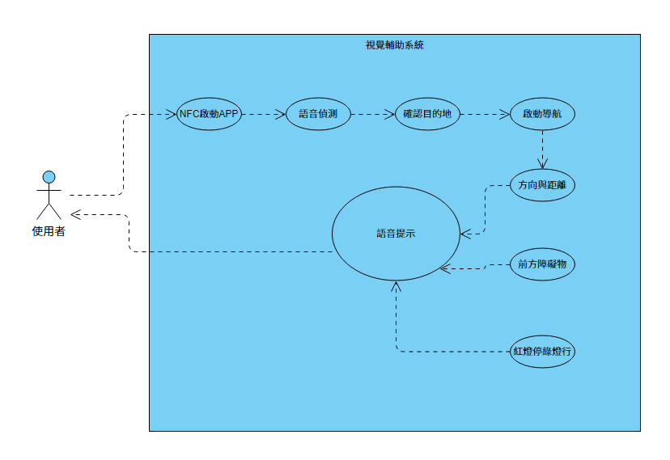
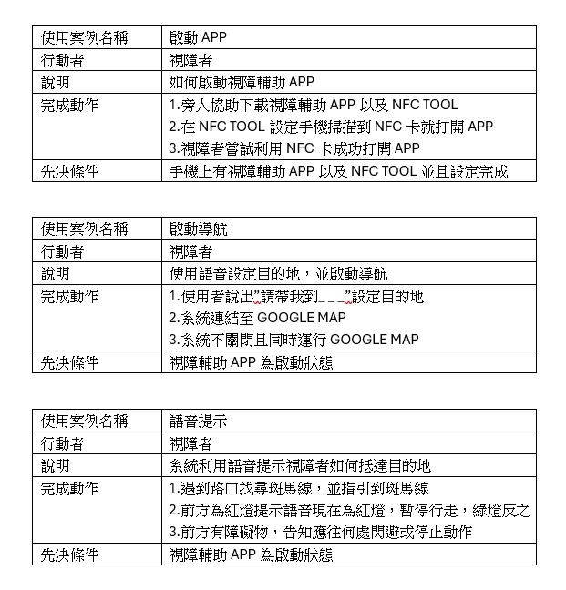

# 小組作業3:

## 功能性需求(至少三個)
1. Fast-SCNN偵測圖片中物件的實際距離
2. YOLOv5偵測圖片中物品的類型
3. 導航功能
4. 語音辨識
5. 語音助理

## 非功能性需求(至少三個)
1. 提升照片處理效率
2. 優化使用者介面
3. 額外訓練增加AI準確度

## 功能分解圖(functional decomposition diagram, FDD 如 ppt p38)

## 使用案例圖 三個以上的使用案例說明 (如 ppt p 44)

## 使用案例圖 照顧者
| **使用案例名稱** | 收到警告                           |
|------------------|------------------------------------|
| **行動者**       | 照顧者                             |
| **說明**         | 視障者可能摔倒，或是螢幕偵測不出東西 |
| **完成動作**     | 1. 進行即時畫面同步，查看視障者目前的手機鏡頭畫面 2. 進行及時語音聯絡，確認是否發生意外 3. 查詢視障者所在位置，若視障者無回應可以到現場幫助 |
| **先決條件**     | 與視障者帳號有連結                  |
