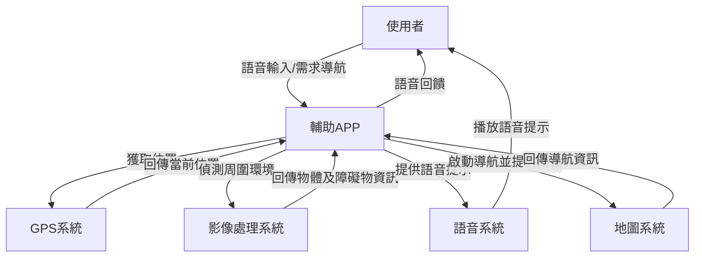
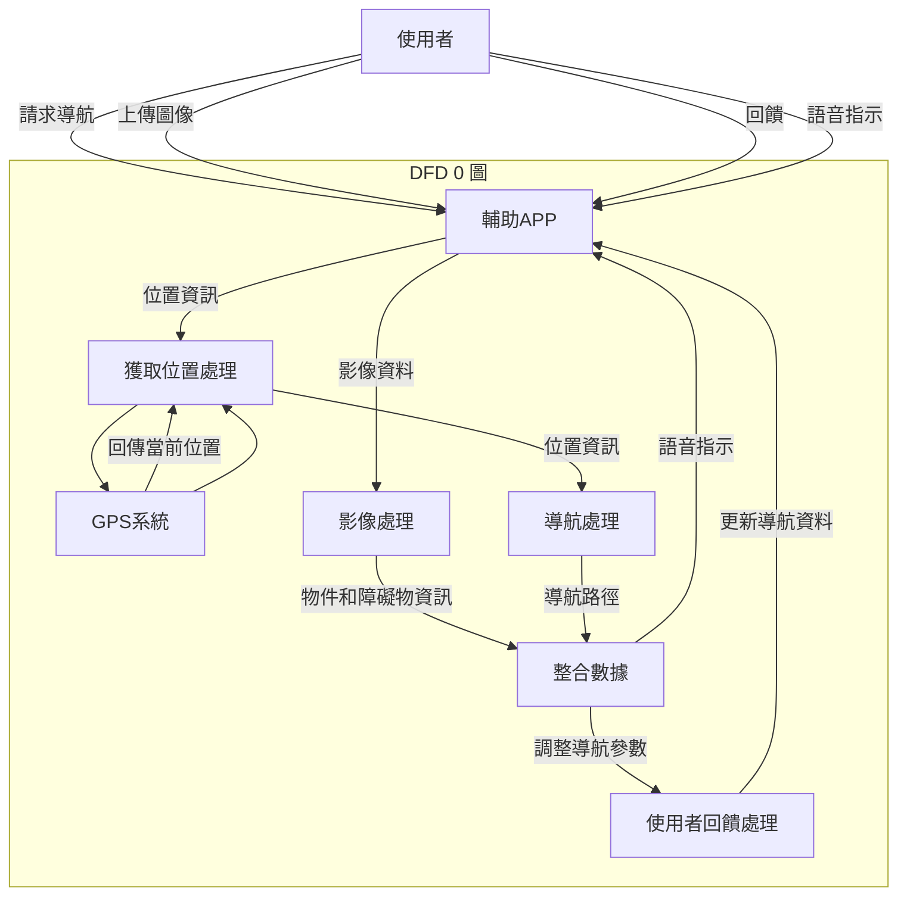

# 小組作業4:

## 繪出系統環境圖 (DFD)

## 繪製DFD 圖0 (須至少有三項以上的 程序)

# test
[example](https://lucid.app/lucidchart/894bf7f1-2374-4871-8ea4-2faefd8ee8a7/edit?shared=true&page=0_0#)  
[example](https://lucid.app/lucidchart/8dedf4c3-5f60-4c8a-b19c-889225e00b1c/edit?shared=true&page=0_0#)  
[test](https://online.visual-paradigm.com/share.jsp?id=333636303635342d31)  
