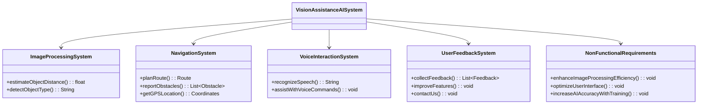

# 小組作業5:

## 繪出UML 類別圖(class Diagram)

```mermaid
classDiagram
    class VisionAssistanceAISystem {
    }

    VisionAssistanceAISystem --> ImageProcessingSystem
    VisionAssistanceAISystem --> NavigationSystem
    VisionAssistanceAISystem --> VoiceInteractionSystem
    VisionAssistanceAISystem --> UserFeedbackSystem
    VisionAssistanceAISystem --> NonFunctionalRequirements

    class ImageProcessingSystem {
        +estimateObjectDistance(): float
        +detectObjectType(): String
    }

    class NavigationSystem {
        +planRoute(): Route
        +reportObstacles(): List~Obstacle~
        +getGPSLocation(): Coordinates
    }

    class VoiceInteractionSystem {
        +recognizeSpeech(): String
        +assistWithVoiceCommands(): void
    }

    class UserFeedbackSystem {
        +collectFeedback(): List~Feedback~
        +improveFeatures(): void
        +contactUs(): void
    }

    class NonFunctionalRequirements {
        +enhanceImageProcessingEfficiency(): void
        +optimizeUserInterface(): void
        +increaseAIAccuracyWithTraining(): void
    }
```

## 繪製循序圖與活動圖 (須至少有三項以上的 使用案例，每個使用案例一個循序圖與活動圖)

