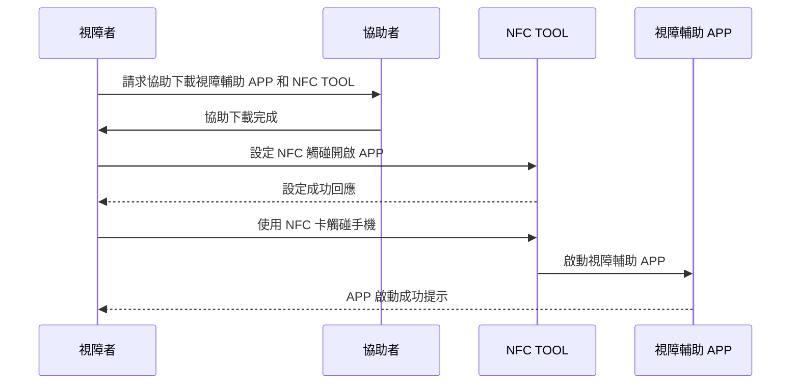
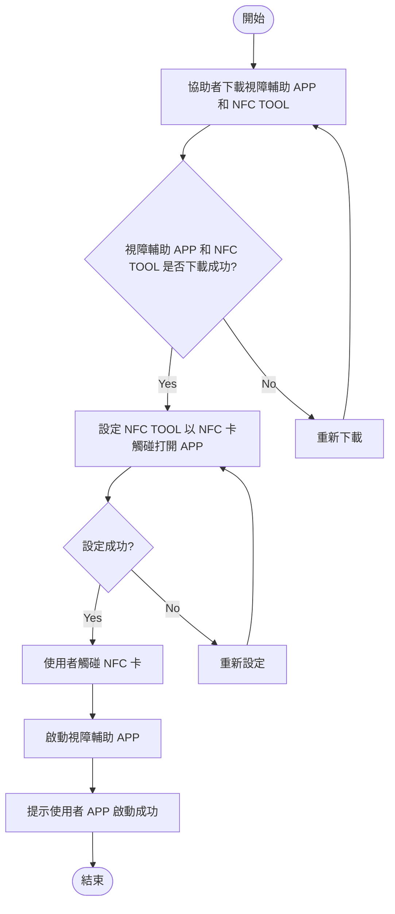
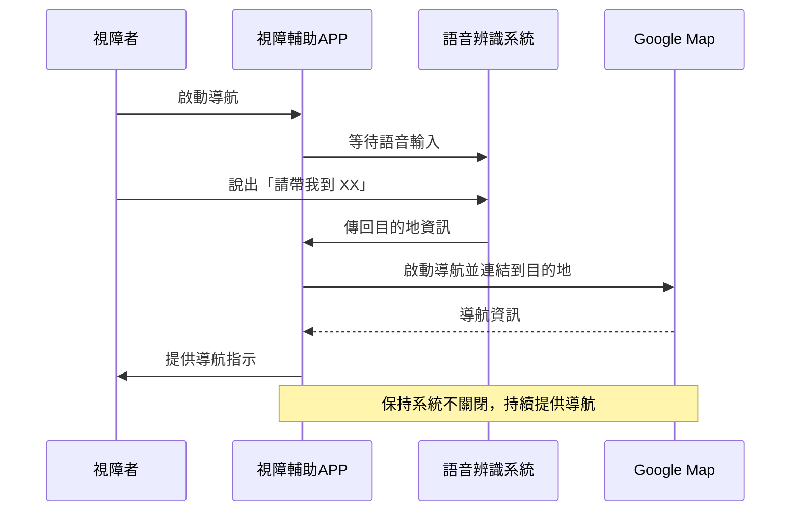
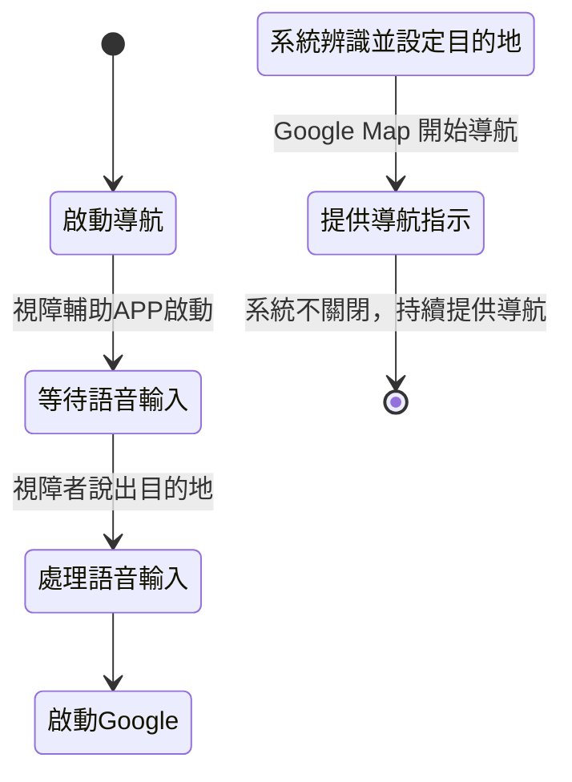
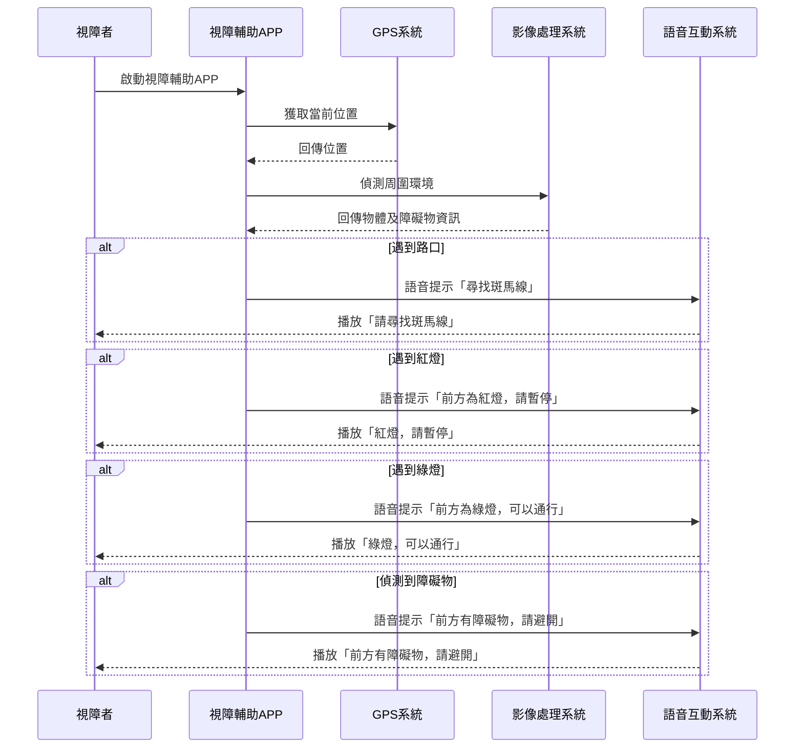
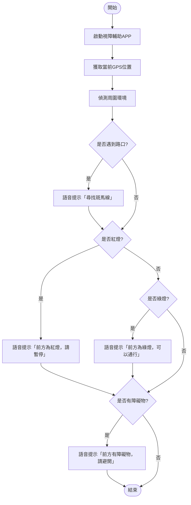

# 小組作業5:

## 繪出UML 類別圖(class Diagram)

```mermaid
classDiagram
    class VisionAssistanceAISystem {
    }

    VisionAssistanceAISystem --> ImageProcessingSystem
    VisionAssistanceAISystem --> NavigationSystem
    VisionAssistanceAISystem --> VoiceInteractionSystem
    VisionAssistanceAISystem --> UserFeedbackSystem
    VisionAssistanceAISystem --> NonFunctionalRequirements

    class ImageProcessingSystem {
        +estimateObjectDistance(): float
        +detectObjectType(): String
    }

    class NavigationSystem {
        +planRoute(): Route
        +reportObstacles(): List~Obstacle~
        +getGPSLocation(): Coordinates
    }

    class VoiceInteractionSystem {
        +recognizeSpeech(): String
        +assistWithVoiceCommands(): void
    }

    class UserFeedbackSystem {
        +collectFeedback(): List~Feedback~
        +improveFeatures(): void
        +contactUs(): void
    }

    class NonFunctionalRequirements {
        +enhanceImageProcessingEfficiency(): void
        +optimizeUserInterface(): void
        +increaseAIAccuracyWithTraining(): void
    }
```

## 繪製循序圖與活動圖 (須至少有三項以上的 使用案例，每個使用案例一個循序圖與活動圖)

### 一、啟動APP 循序圖與活動圖

```mermaid
sequenceDiagram
    participant User as 視障者
    participant Assistant as 協助者
    participant NFCTool as NFC TOOL
    participant App as 視障輔助 APP

    User ->> Assistant: 請求協助下載視障輔助 APP 和 NFC TOOL
    Assistant ->> User: 協助下載完成
    User ->> NFCTool: 設定 NFC 觸碰開啟 APP
    NFCTool -->> User: 設定成功回應
    User ->> NFCTool: 使用 NFC 卡觸碰手機
    NFCTool ->> App: 啟動視障輔助 APP
    App -->> User: APP 啟動成功提示
```

```mermaid
flowchart TD
    Start([開始]) --> A[協助者下載視障輔助 APP 和 NFC TOOL]
    A --> B{視障輔助 APP 和 NFC TOOL 是否下載成功?}
    B -- Yes --> C[設定 NFC TOOL 以 NFC 卡觸碰打開 APP]
    C --> D{設定成功?}
    D -- Yes --> E[使用者觸碰 NFC 卡]
    E --> F[啟動視障輔助 APP]
    F --> G[提示使用者 APP 啟動成功]
    G --> End([結束])
    
    B -- No --> H[重新下載]
    H --> A
    D -- No --> I[重新設定]
    I --> C
```
### 二、啟動導航 循序圖與活動圖

```mermaid
sequenceDiagram
    participant User as 視障者
    participant App as 視障輔助APP
    participant Voice as 語音辨識系統
    participant Map as Google Map
    
    User ->> App: 啟動導航
    App ->> Voice: 等待語音輸入
    User ->> Voice: 說出「請帶我到 XX」
    Voice ->> App: 傳回目的地資訊
    App ->> Map: 啟動導航並連結到目的地
    Map -->> App: 導航資訊
    App ->> User: 提供導航指示
    Note over App, Map: 保持系統不關閉，持續提供導航
```

```mermaid
stateDiagram-v2
    [*] --> 啟動導航
    啟動導航 --> 等待語音輸入: 視障輔助APP啟動
    等待語音輸入 --> 處理語音輸入: 視障者說出目的地
    處理語音輸入 --> 啟動Google Map: 系統辨識並設定目的地
    啟動Google Map --> 提供導航指示: Google Map 開始導航
    提供導航指示 --> [*]: 系統不關閉，持續提供導航
```
### 三、語音提示 循序圖與活動圖

```mermaid
sequenceDiagram
    participant User as 視障者
    participant App as 視障輔助APP
    participant GPS as GPS系統
    participant Vision as 影像處理系統
    participant Voice as 語音互動系統

    User ->> App: 啟動視障輔助APP
    App ->> GPS: 獲取當前位置
    GPS -->> App: 回傳位置
    App ->> Vision: 偵測周圍環境
    Vision -->> App: 回傳物體及障礙物資訊

    alt 遇到路口
        App ->> Voice: 語音提示「尋找斑馬線」
        Voice -->> User: 播放「請尋找斑馬線」
    end

    alt 遇到紅燈
        App ->> Voice: 語音提示「前方為紅燈，請暫停」
        Voice -->> User: 播放「紅燈，請暫停」
    end

    alt 遇到綠燈
        App ->> Voice: 語音提示「前方為綠燈，可以通行」
        Voice -->> User: 播放「綠燈，可以通行」
    end

    alt 偵測到障礙物
        App ->> Voice: 語音提示「前方有障礙物，請避開」
        Voice -->> User: 播放「前方有障礙物，請避開」
    end
```

```mermaid
flowchart TD
    Start([開始])
    A1[啟動視障輔助APP]
    A2[獲取當前GPS位置]
    A3[偵測周圍環境]
    
    decision1{是否遇到路口?}
    decision2{是否紅燈?}
    decision3{是否綠燈?}
    decision4{是否有障礙物?}
    
    A4[語音提示「尋找斑馬線」]
    A5[語音提示「前方為紅燈，請暫停」]
    A6[語音提示「前方為綠燈，可以通行」]
    A7[語音提示「前方有障礙物，請避開」]

    End([結束])

    Start --> A1 --> A2 --> A3
    A3 --> decision1

    decision1 -- 是 --> A4 --> decision2
    decision1 -- 否 --> decision2

    decision2 -- 是 --> A5 --> decision4
    decision2 -- 否 --> decision3

    decision3 -- 是 --> A6 --> decision4
    decision3 -- 否 --> decision4

    decision4 -- 是 --> A7 --> End
    decision4 -- 否 --> End
```
