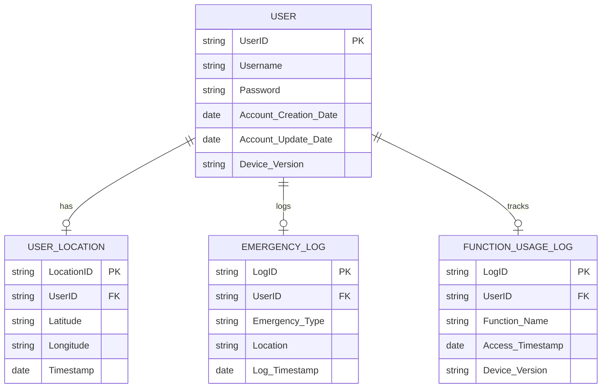

# 小組作業 7
## 請劃出實體關係圖ERD 向使用者展示內部的資料庫設計

## 請列出兩個以上的組合實體
1. 使用者與功能使用紀錄
組合實體： USER + FUNCTION_USAGE_LOG
關聯： 每個使用者有多個功能使用紀錄，紀錄了每次使用功能的時間、功能名稱及裝置版本。
2. 使用者與位置紀錄
組合實體： USER + USER_LOCATION
關聯： 每個使用者有多個位置紀錄，儲存使用者在不同時間點的緯度與經度。
